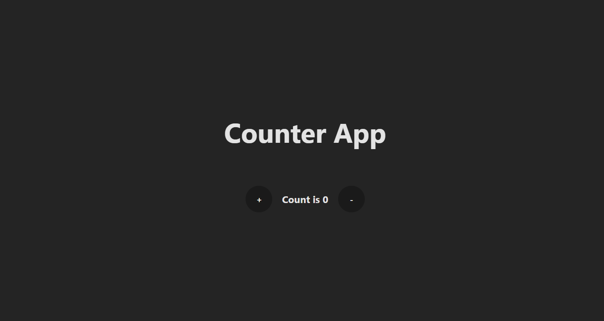

# React Counter App

A clean and simple counter application built as a foundational project for learning modern web development with React and Vite. This project focuses on core concepts and best practices in a clear and concise manner.

 

---

## ✨ Features

* **Increment:** Increase the count by one.
* **Decrement:** Decrease the count by one.
* **Responsive:** Simple and clean interface that works on all screen sizes.

---

## 🛠️ Tech Stack

This project was built using the following technologies:

* **[React](https://react.dev/):** A JavaScript library for building user interfaces.
* **[Vite](https://vitejs.dev/):** A modern frontend build tool that provides an extremely fast development experience.
* **JavaScript (ES6+):** The programming language used for the application logic.
* **CSS:** For custom styling and layout.

---

## 🚀 Getting Started

Follow these instructions to get a copy of the project up and running on your local machine for development and testing purposes.

### Prerequisites

You need to have [Node.js](https://nodejs.org/) and `npm` installed on your machine.

### Installation

1.  **Clone the repository:**
    ```sh
    git clone [https://github.com/YOUR_USERNAME/YOUR_REPOSITORY_NAME.git](https://github.com/YOUR_USERNAME/YOUR_REPOSITORY_NAME.git)
    ```
    *(Replace `YOUR_USERNAME` and `YOUR_REPOSITORY_NAME` with your actual GitHub details)*

2.  **Navigate to the project directory:**
    ```sh
    cd YOUR_REPOSITORY_NAME
    ```

3.  **Install NPM packages:**
    ```sh
    npm install
    ```

4.  **Run the development server:**
    ```sh
    npm run dev
    ```

The application will now be running on `http://localhost:5173` (or the next available port).

---

## 🎯 Learning Goals

This project served as a hands-on exercise to understand and implement the following core React concepts:

* **Component-Based Architecture:** Structuring the UI into reusable, self-contained components (`Counter.jsx`).
* **State Management:** Using the `useState` hook to manage and update component state.
* **Event Handling:** Capturing user interactions (like button clicks) with `onClick` event handlers.
* **JSX Syntax:** Writing declarative UI inside JavaScript.
* **Functional State Updates:** Using a callback function (`setCount(prevCount => prevCount + 1)`) to ensure safe and predictable state transitions.
* **Modern Development Workflow:** Utilizing Vite for project scaffolding and running a fast development server.
