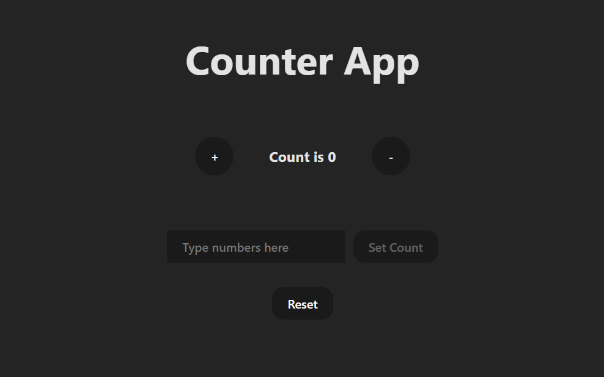

# React Counter App

An interactive counter application built with React and Vite. This project demonstrates fundamental and intermediate React concepts by creating a dynamic and responsive user interface.

 

---

## ✨ Features

* **Increment/Decrement:** Increase or decrease the count.
* **Non-Negative Guard:** Prevents the counter from going below zero.
* **Set Custom Count:** Use the input field to set the counter to any non-negative number.
* **Reset:** Instantly reset the counter back to zero.
* **Smart Button:** The "Set Count" button is disabled until you type a number, preventing empty inputs.

---

## 🛠️ Tech Stack

This project was built using the following technologies:

* **[React](https://react.dev/):** A JavaScript library for building user interfaces.
* **[Vite](https://vitejs.dev/):** A modern frontend build tool that provides an extremely fast development experience.
* **JavaScript (ES6+):** The programming language used for the application logic.
* **CSS:** For custom styling and layout.

---

## 🚀 Getting Started

Follow these instructions to get a copy of the project up and running on your local machine for development and testing purposes.

### Prerequisites

You need to have [Node.js](https://nodejs.org/) and `npm` installed on your machine.

### Installation

1.  **Clone the repository:**
      ```sh
    git clone https://github.com/YasasBanuka/vite-counter-app.git
    ```

2.  **Navigate to the project directory:**
    ```sh
    cd vite-counter-app
    ```

3.  **Install NPM packages:**
    ```sh
    npm install
    ```

4.  **Run the development server:**
    ```sh
    npm run dev
    ```

The application will now be running on `http://localhost:5173` (or the next available port).

---

## 🎯 Learning Goals

This project served as a hands-on exercise to understand and implement the following core React concepts:

* **State Management (`useState`):** Managing multiple pieces of state (`count`, `inputNum`) within a single component.
* **Controlled Components:** Binding the value of an input field to the component's state to create a single source of truth.
* **Event Handling(`onClick`, `onChange`):** Capturing user interactions to trigger state updates and logic.
* **Conditional Logic:** Conditionally disabling a button based on the component's state (`disabled={inputNum === ""}`).
* **Functional State Updates:** Using a callback function (`setCount(prevCount => ...`) to ensure safe and predictable state transitions based on the previous state.
